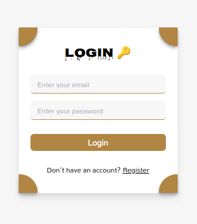
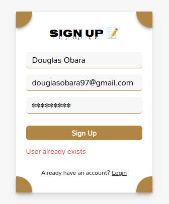
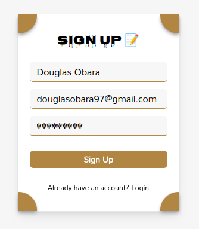
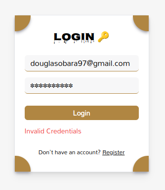
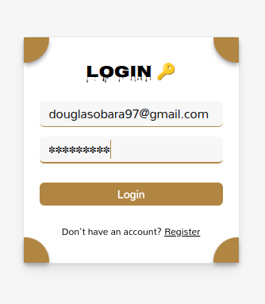
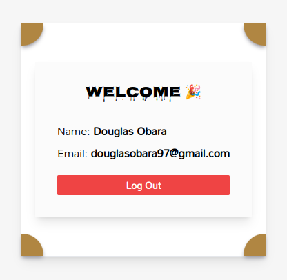

# Authentication: Custom Email/Password with NextAuth.js & MongoDB 🔒

## Screenshots 📸

#### Sign Up & Login

  
<a href="https://customemailpasswordauthapp.vercel.app/">
  
<a>

<a href="https://customemailpasswordauthapp.vercel.app/">
  
<a>

### Error When same Email address already registered in the database  ❌

  
<a href="https://customemailpasswordauthapp.vercel.app/">
  
<a>

<a href="https://customemailpasswordauthapp.vercel.app/">
  
<a>

### Error When trying to login with invalid credentials  ❌

  
<a href="https://customemailpasswordauthapp.vercel.app/">
  
<a>

<a href="https://customemailpasswordauthapp.vercel.app/">
  
<a>

### successful login ✅

  
<a href="https://customemailpasswordauthapp.vercel.app/">
  
<a>

## Setup ✴️

- [x] Clone the repository using `https://github.com/Douglas254/authapp.git` or download and extract the zip file.
- [x] Open up the cloned folder in your preferred text editor. Open up a terminal within your workspace and navigate into the /authapp folder
- [x] Within that folder, run `npm install` which will install all dependencies for you then run `npm run dev` to run the development server on `http://localhost:3000/` :boom:

## Deployment ~ Vercel 🌍

View hosted site [here](https://customemailpasswordauthapp.vercel.app/)

## Authors 🖊️

This project was contributed to by:

- [Douglas Obara](https://github.com/douglas254/)

## License 📄

The project is licensed under MIT